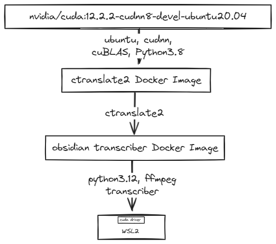

> Note The purpose of this document is to capture the thought process and steps taken to build the Windows Dockerfile.  This was a new experience for me.  I stepped into many rabbit holes and wanted to capture some of the lessons learned for reference. _spoiler alert_ - A big AHA moment was understanding the power in Linux-based Docker containers vs the agony of attempting to build a native Windows Docker container. AND installing the software goop required to gain access to the GPU is a R-E-A-L S-L-O-G.  The amount of wasted hours - lifetimes of hours - by all of us who go through it must be staggering.

# Windows Dockerfile
The Windows Dockerfile, `dockerfile.wsl2`, runs the Obsidian Transcriber Service (OTS) using GPUs when available.  The OTS is dependent on the `ctranslate2` Python package to provide audio to text translation. The `WSL2` compatibility layer is used so that Linux-based Docker containers (like those from NVidia and others) can run directly on the `WSL2` layer.

The biggest challenge in building the OTS docker image is understanding what `cuda` components to install and where to install them.  Looking at NVidia's `cuda` layers:
<div style="text-align: center;">

  

</div>

The `CUDA` toolkit and `CUDA` driver need to be available for `ctranslate2` to access the GPUs.

Keeping that in mind, let's look at the contents of the Docker image.
## Building the Windows Dockerfile
The boxes in this image are intended to give a good idea on how the Windows Dockerfile is put together:

<div style="text-align: center;">

  

</div>
### Start  with a Good Base - the ctranslate2 Docker Image

### ctranslate2 dockerfile
A Yoga lesson I learned awhile back was to start with a Good Base.  This implementation of this project assumes `ctranslate2`.  The [`ctranslate2` github includes a dockerfile](https://github.com/OpenNMT/CTranslate2/blob/master/docker/Dockerfile) that will be the base docker image used for the OTS dockerfile.

The `ctranslate2` image relies on NVidia's base image.  The NVidia base image includes :
- Ubuntu 20.04 LTS is used as the container base image (AKA "Container OS User Space" in the NVidia image).  This also includes Python 3.8
- The `CUDA` Toolkit (see NVidia image) which include the  `cudnn` and `cuBLAS` libraries used by `ctranslate2` for GPU processing.
The output of this image includes availability of the software installed by the NVidia image as well as `ctranslate2` .

On to the OTS dockerfile.
### OTS dockerfile
The OTS dockerfile:
- Updates Python 3.8 to Python 3.12.
> Note I had done development with `Python 3.12`.  Errors occurred running the code using `Python3.8` that did not occur using `Python3.12`.
- Installs `ffmpeg` which is used by `yt_dlp` when creating the audio file to be used for transcription.
- Installs the Obsidian Transcriber code.
#### Installing Python 3.12
There are two ways to do this:

1. Use the deadsnakes PPA to install Python 3.12. Two resources that were helpful in understanding the process are:
    - [YouTube video _What is deadsnakes? (beginner - intermediate) anthony explains #058_](https://www.youtube.com/watch?v=Xe40amojaXE)
    - [PPA documentation on deadsnakes](https://launchpad.net/~deadsnakes/+archive/ubuntu/ppa)

2. Build Python 3.12 from source for Ubuntu 20.04.  A helpful resource is:
    - [CrownCloud wiki](https://wiki.crowncloud.net/?How_to_Install_Python_3_12_on_Ubuntu_20_04#Update+System)

I ended up using the deadsnakes PPA to install Python 3.12. This was the easiest and created a smaller image.

##### Installing from Deadsnakes PPA Installation
The steps I used to build Python 3.12 from the deadsnakes PPA are:
```
RUN apt-get update && \
    apt-get install -y -qqq software-properties-common && \
    ppa:deadsnakes && \
    apt-get install -y -qqq python3.12
```
##### Installing from Source

```
# Update system and install required dependencies
RUN apt-get update -y && apt-get upgrade -y && \
    apt-get install -y build-essential libssl-dev zlib1g-dev libbz2-dev \
    libreadline-dev libsqlite3-dev wget curl llvm libncurses5-dev libncursesw5-dev \
    xz-utils tk-dev libffi-dev liblzma-dev python-openssl git && \
    rm -rf /var/lib/apt/lists/*

# Build Python 3.12
RUN wget https://www.python.org/ftp/python/3.12.0/Python-3.12.0.tgz && \
    tar -xf Python-3.12.0.tgz && \
    cd Python-3.12.0 && \
    ./configure --enable-optimizations && \
    make -j 8 && \
    make altinstall && \
    python3.12 --version && \
    cd .. && \
    rm -rf Python-3.12.0 Python-3.12.0.tgz
```

## CUDA Driver
The final step to enable GPU access is installing the NVidia CUDA drivers on the Windows PC.  The code and directions can be found on the [NVidia's page, CUDA on WSL](https://developer.nvidia.com/cuda/wsl).  The drivers must be installed before `ctranslate2` can access the GPU.
